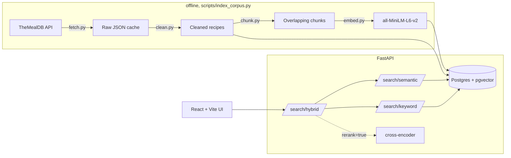

# Semantic Search Engine

Hybrid (vector + keyword) semantic search over a real recipe dataset. Type a
craving, not a keyword — `"warm comfort food for a rainy day"` returns soups
and stews with zero literal overlap with the query.

## Problem statement

Keyword search fails on paraphrase ("something to warm me up" won't match
"soup" without matching words). Pure vector search fails on exact terms it
has never seen in context (an out-of-vocabulary ingredient name gets matched
on surface-level token similarity to unrelated words, not meaning). This
project builds both, measures each on the same 20-query eval set, and blends
them — rather than picking one and asserting it's better.

## Architecture



- **Backend:** FastAPI, raw SQL via psycopg 3 (no ORM — the vector and
  full-text queries are the interesting part of this project; an ORM would
  obscure them behind generated SQL)
- **Vector store:** Postgres + [pgvector](https://github.com/pgvector/pgvector),
  HNSW index over cosine distance
- **Keyword search:** Postgres full-text search (weighted `tsvector` + GIN
  index + `ts_rank_cd`)
- **Embeddings:** [sentence-transformers](https://www.sbert.net/)
  `all-MiniLM-L6-v2` (local, free, no API key). OpenAI `text-embedding-3-small`
  is a swappable alternative behind the same interface (`USE_OPENAI_EMBEDDINGS=true`)
- **Reranking:** `cross-encoder/ms-marco-MiniLM-L-6-v2`, optional, toggleable
- **Frontend:** React (Vite) + Tailwind CSS v4
- **Containerization:** Docker Compose (Postgres verified in-container;
  see [Known limitation](#known-limitation-docker-compose-up-for-the-backendfrontend-containers))

## Quickstart

```bash
git clone https://github.com/aimanmunshi/HybridSearch.git
cd HybridSearch
cp .env.example .env
```

**Option A — one command** (needs a few GB of free disk for the backend
image, which bundles PyTorch):

```bash
docker compose up --build
```

**Option B — native dev commands** (what was actually used throughout
development; see [Known limitation](#known-limitation-docker-compose-up-for-the-backendfrontend-containers)
below for why):

```bash
docker compose up -d postgres   # Postgres + pgvector only

cd backend
python -m venv .venv && source .venv/Scripts/activate  # or .venv/bin/activate on macOS/Linux
pip install -r requirements-dev.txt
python -m scripts.index_corpus    # fetch, clean, chunk, embed, index ~789 recipes (~2-3 min on CPU)
uvicorn app.main:app --reload     # http://localhost:8000

# in a second terminal
cd frontend
npm install
npm run dev                       # http://localhost:5173
```

Either way: backend at http://localhost:8000, frontend at http://localhost:5173.

Run the test suite (needs Postgres running; uses a separate `semantic_search_test`
database so it never touches the indexed corpus):

```bash
cd backend
pytest
```

Run the evaluation harness:

```bash
cd backend
python -m eval.run_eval
```

### Known limitation: `docker compose up` for the backend/frontend containers

`docker-compose.yml` defines all three services (Postgres, backend,
frontend), and Postgres-in-Docker (with the pgvector extension) was verified
extensively throughout development. The backend and frontend **container
builds were not successfully completed** in this development environment:
the machine's system drive repeatedly ran out of disk space mid-build (a
pre-existing, unrelated 12GB file elsewhere on that disk, not anything this
project created) and crashed Docker Desktop twice before the build could
finish. The backend Dockerfile was updated to install CPU-only torch (see
`backend/Dockerfile`) specifically to reduce that footprint, but a full,
successful `docker compose up --build` for all three services together was
not re-confirmed after that fix.

What *was* verified end-to-end, repeatedly, throughout development: the
backend and frontend running via their native dev commands (`uvicorn`,
`npm run dev`) against Postgres in Docker, including the full search UI
tested live in-browser (all four modes, mobile viewport, error states). This
is the Quickstart path above. If `docker compose up --build` fails on disk
space for you, that native-dev-command path is the tested fallback, not a
downgrade.

## Screenshots

*(Placeholder — not yet captured as image files in this revision.)* The demo
worth capturing: search `gochujang` in **Semantic** mode (unrelated dishes
like `gazpacho` and `goulash` outrank the one recipe that actually contains
it — the model has no real sense of an out-of-vocabulary ingredient name),
then flip to **Hybrid** mode with the same query and watch
`General Tso's Chicken` — entirely absent a moment ago — jump into the top
results. Reproducible in under a minute via the Quickstart above.

## Evaluation results

20 hand-labeled queries; ground truth derived from objective corpus metadata
(category/cuisine columns or an exact substring match), not from eyeballing
search results — full methodology, including two manual corrections caught by
a review pass, in [`backend/eval/README.md`](backend/eval/README.md).

| Mode | Mean precision@5 |
|---|---|
| Semantic only | 0.660 |
| **Hybrid** | **0.740** |
| Hybrid + rerank | 0.490 |

Hybrid beating semantic-only validates the core thesis. Reranking making
things *worse* is reported rather than hidden — see
[Tradeoffs](#tradeoffs--design-decisions) below.

Full per-query breakdown: [`backend/eval/results/report.md`](backend/eval/results/report.md).

## Tradeoffs & design decisions

**Why pgvector over a hosted vector DB (Pinecone, Weaviate, ...).** The brief
asked for this explicitly, and it's the right call for the resume too:
pgvector is a more transferable skill (it's "Postgres with an extension," not
a new system to learn), it means one database instead of two to keep in sync,
and at this corpus size (~1,700 vectors) a hosted vector DB's main
selling point — scaling to millions of vectors — doesn't apply. The honest
cost: pgvector's ANN indexes (HNSW here) matter far less at this scale than
they would at scale; a sequential scan would often be competitive. HNSW is
still the right choice going in, not because it wins today, but because it's
what makes the design correct as the corpus grows, and because — unlike
IVFFlat — it doesn't need a training step after the data loads.

**Why Postgres full-text search over `rank_bm25`.** The corpus already lives
in Postgres, so `tsvector`/`tsquery`/GIN needs no separate in-memory index to
build and keep in sync with the corpus. The cost: `ts_rank_cd` approximates
BM25's term-frequency saturation but isn't identical to it — a real tradeoff,
made explicitly rather than by default.

**Why `all-MiniLM-L6-v2`.** Free, runs locally on CPU in real time (~150ms
warm), and small enough (80MB) that first-run model download isn't painful.
The cost is a 256-token context window, which is *why chunking exists at
all* — 54% of recipes in this corpus would be silently truncated without it
(see `backend/app/ingestion/chunk.py`). `text-embedding-3-small` is wired in
as a drop-in alternative for anyone who wants higher quality and doesn't mind
an API key and per-query cost.

**Why hybrid scoring is query-relative min-max normalization, not a fixed
formula.** Cosine similarity and `ts_rank_cd` are on incomparable scales, so
neither can be added to the other directly. Min-max needs no corpus-wide
calibration constant and adapts per query — at the cost of being sensitive to
the candidate pool's composition (one overwhelming keyword match compresses
every other keyword score toward 0). Accepted tradeoff at this scale, flagged
in `backend/app/search/hybrid.py` rather than hidden.

**Why reranking is optional, not default.** The eval says so: hybrid+rerank
scores *worse* (0.490 vs. hybrid's 0.740) on this project's ground truth.
`ms-marco-MiniLM-L-6-v2` was trained on web-search relevance judgments, and
its notion of "relevant" doesn't line up with this eval's category/cuisine-
based labels. It stays in as a toggle because it's a real technique worth
demonstrating and does visibly reorder results in reasonable-looking ways on
manual inspection (see commit history) — but the data doesn't support
defaulting to it, so it doesn't default to it.

**Why TheMealDB over a synthetic dataset.** Real, community-written
instructions gave the embeddings genuine natural-language variety (and
genuine noise — see the tag mislabeling in the eval methodology) that a
generated dataset wouldn't have produced convincingly.

## What I'd improve with more time

- **A domain-tuned reranker.** Fine-tune a small cross-encoder on
  recipe-specific relevance judgments instead of relying on a web-search model
  — the eval result above is a direct pointer at this being worth doing.
- **Query result caching.** Identical queries currently re-embed and re-query
  every time; an LRU cache keyed on `(mode, query, top_k, alpha)` would cut
  latency and DB load for a live demo with repeat queries.
- **A learned hybrid weight.** `alpha=0.5` is a reasonable, disclosed default,
  not a tuned one — a small labeled set could fit it (or fit it per query
  type: exact-term queries want more keyword weight, vibe queries want more
  semantic weight).
- **Pagination and streaming.** Results currently come back as one batch;
  for larger corpora, cursor-based pagination and streaming the embedding
  step's progress would matter.
- **CI.** GitHub Actions running `pytest` (with an ephemeral Postgres service
  container) and the frontend build on every push — straightforward, just
  not built yet.
- **Full `docker compose up` re-verification** once off this development
  machine's disk constraints, as noted above.
